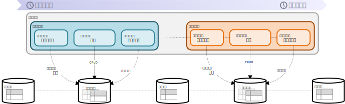

= データベースの初期化

パラメータファイルをもとにデータベースにテストデータを投入することができます。 +
テストデータの投入、テスト中のデータベースアクセスはトランザクション管理され、テスト完了時にロールバックされるので、テスト完了後、データベースはテスト実行前の状態に戻ります。 +
また、テストメソッド実行後はデータベースのロールバック後にテストデータが再投入されるため、テストメソッド内でテストデータを更新しても、次のテストメソッドでは更新されていないテストデータで実行されます。

.テストの流れ

テストデータの投入量はパフォーマンスに影響するので、基本的に入れ替えの必要がないマスタデータは事前にデータベースに投入しておき、テストパターンによってデータパターンを変更する必要のあるトランザクションデータを本機能で投入する方法をおすすめします。

== 基本的な記載方法

``TableValueSource``アノテーションをクラスやメソッドに指定することで、テストメソッド実行時にデータベースにテストデータを投入されます。

.データベースの初期化
[source, java]
----
@TableValueSource("prepare_class_data.xlsx")                <1>
class testClass {

    @Test
    @TableValueSource(path = "prepare_method_data.xlsx")    <2>
    void testMethod() {
        ・
        ・
        ・
    }
}
----

<1> クラス単位の初期化で使用するパラメータファイルのファイルパスを指定した``TableValueSource``アノテーションをクラスに指定します。 +
<2> メソッド単位の初期化で使用するパラメータファイルのファイルパスを指定した``TableValueSource``アノテーションをメソッドに指定します。ファイルパスを指定する属性を明示する場合、path属性を使用します。

データベースの初期化は、クラスに指定された``TableValueSource``アノテーションに指定されたパラメータファイルによる初期化後、メソッドに指定された``TableValueSource``アノテーションに指定されたパラメータファイルによる初期が実行されます。 +
クラスに指定する初期化用パラメータファイルにはテストクラスで共通のテストデータを記載し、メソッドに指定する初期化用パラメータにはテストメソッド固有のテストデータを記載することで、パラメータファイルを共通化できます。 +
パラメータファイルの記載方法はlink:parameter-file.ja.adoc[パラメータファイル]を参照してください。

== パラメータファイルのオプション

=== Excel形式のオプション

Excel形式のオプションは、TableValueSourceアノテーションのexcelMeta属性にTableExcelMetaアノテーションを指定し、そのTableExcelMetaアノテーションの属性で指定します。

.Excel形式のオプション
[source, java]
----
@TableValueSource(path = "prepare_class_data.xlsx", excelMeta = @TableExcelMeta(...))    <1>
class testClass {
----

<1> excelMeta属性にTableExcelMetaアノテーションを指定し、TableExcelMetaアノテーションの属性でExcel形式のオプションを指定します。

==== シート名とテーブル名のマッピング

デフォルトではシート名が初期化対象のテーブル名になります。 +
をテーブル名とは異なる任意のシート名を使用する場合や、シート名の長さの制限である31文字を超えるテーブル名のテーブルを初期化する場合、シート名とテーブル名のマッピングを定義することができます。

.シート名とテーブル名のマッピング
[source, java]
----
@TableValueSource(path = "prepare_class_data.xlsx",
                  excelMeta = @TableExcelMeta(
                      sheetMapping = @SheetMapping(sheet = "sheet1", table = "EMP_TABLE")))    <1>
class testClass {

    @Test
    @TableValueSource(path = "prepare_method_data.xlsx",
                      excelMeta = @TableExcelMeta(
                          sheetMapping = {
                              @SheetMapping(sheet = "sheet1", table = "EMP_TABLE"),
                              @SheetMapping(sheet = "sheet2", table = "DEPT_TABLE") }))        <2>
    void testMethod() {
        ・
        ・
        ・
    }
}
----

<1> TableExcelMetaアノテーションのsheetMapping属性にシート名とテーブル名のマッピングを指定します。sheetMapping属性にSheetMappingアノテーションを指定し、そのSheetMappingアノテーションのsheet属性にシート名を、table属性にテーブル名を文字列で指定することで、シート名とテーブル名がマッピングされます。 +
<2> シート名とテーブル名のマッピングを複数定義する場合、sheetMapping属性にSheetMappingアノテーションの配列を指定します。
