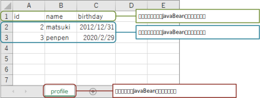
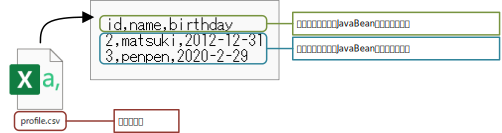

= パラメータファイル

データベースやJava Beanを初期化する初期化ファイルや、データベースやJava Beanの値を検証する期待値ファイルを「パラメータファイル」と呼びます。 +
パラメータファイルはMicrosoft Excel形式、もしくはCSV形式で作成します。

== 基本的な記載方法

1行目はヘッダ行で、テーブルの列名、Java Beanのフィールド名を記載します。 +
2行目以降はデータ行で、テーブルの列値、Java beanのフィールド値を記載します。

Excel形式の場合、シート名にテーブル名、Java Beanクラスの単純名を指定します。 +
CSV形式の場合、ファイル名にテーブル名を指定します。

.Excel形式のサンプル

.CSV形式のサンプル

